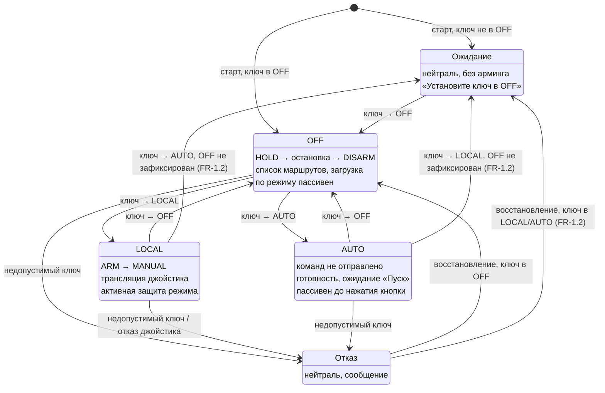
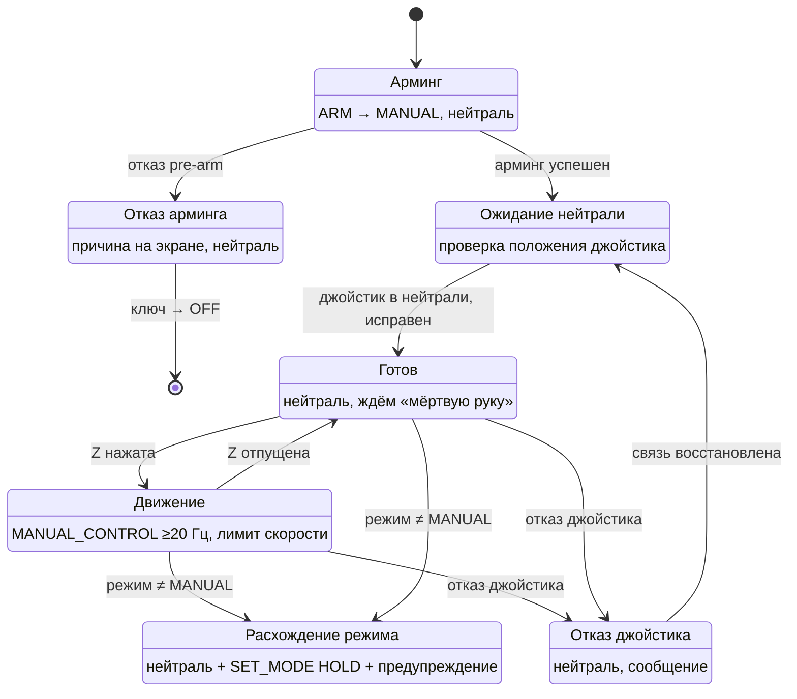
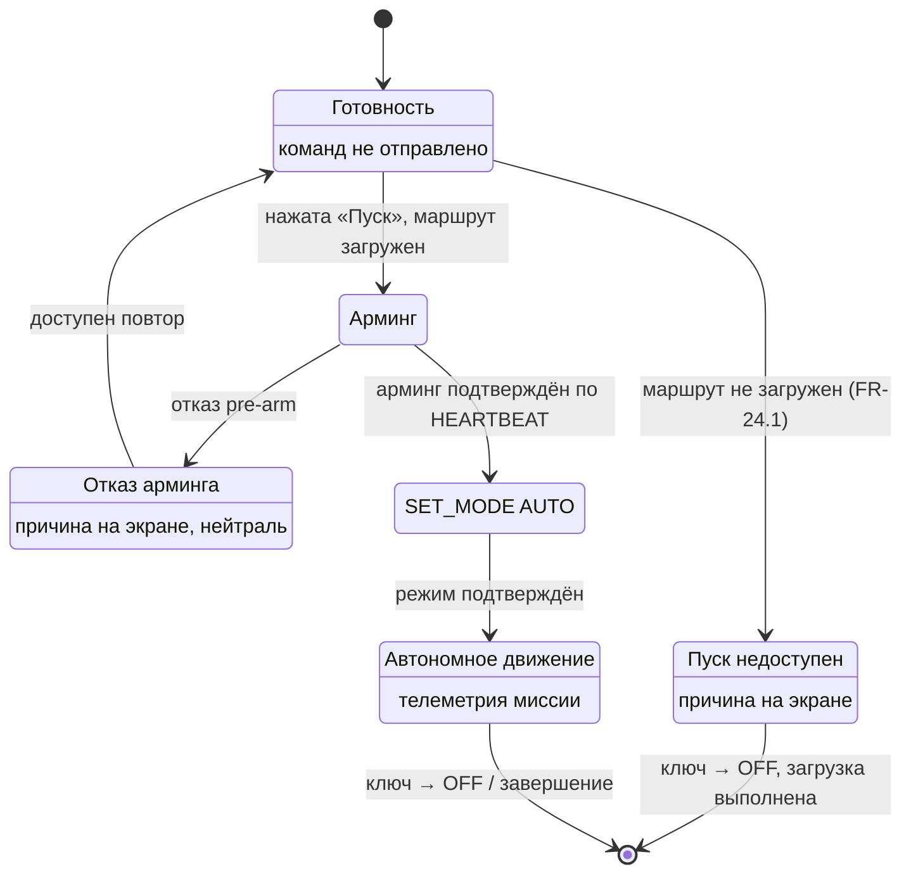
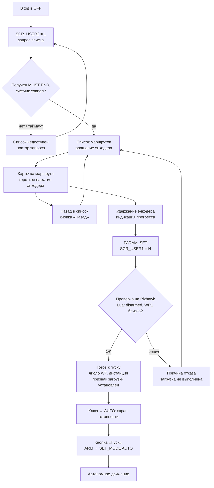

# Встроенный модуль управления платформой — требования к прошивке ESP32

**Документ:** Функциональные и нефункциональные требования, сценарии использования
**Компонент:** Прошивка встроенного модуля управления (далее — Модуль)
**Аудитория:** Разработчики встроенного ПО
**Статус:** Базовая версия для начала разработки

---

## 1. Назначение и область применения

### 1.1. Назначение документа
Документ фиксирует требования к прошивке микроконтроллера ESP32, управляющего встроенным пультом (Модулем) модульной гусеничной платформы логистического назначения. Документ предназначен для разработчиков и является основанием для проектирования и реализации прошивки.

### 1.2. Назначение Модуля
Модуль — это встроенный в тележку пульт локального управления и выбора заданий. Он обеспечивает:
- локальное ручное управление платформой проводным джойстиком (оператор находится рядом с тележкой);
- выбор ранее загруженного полётного задания (маршрута) из списка и отправку его в автопилот;
- перевод платформы в автономный режим выполнения маршрута;
- управление армингом платформы;
- отображение статуса и телеметрии платформы на встроенном дисплее.

### 1.3. Границы ответственности прошивки
Прошивка Модуля отвечает **только** за логику работы ESP32. Прошивка **не** отвечает за:
- логику автопилота (реализована в ArduPilot на Pixhawk);
- загрузку файлов маршрутов в память миссии (реализована Lua-скриптом на Pixhawk);
- фактическое исполнение автономного движения (навигация, объезд препятствий — реализовано ArduPilot на Pixhawk; Модуль только инициирует переход в AUTO по кнопке «Пуск», см. FR-40);
- систему безопасности парктроников и бамперов (реализована отдельными узлами и скриптами);
- аварийную остановку (реализована аппаратно, независимо от Модуля и Pixhawk).

**Важное уточнение (подтверждено тестированием на стенде):** перевод Pixhawk в режим AUTO немедленно запускает выполнение загруженной миссии — дополнительного «разрешающего» сигнала автопилот не требует. Это означает, что момент отправки арминга и `SET_MODE AUTO` **и есть** момент начала движения. Прошивка Модуля обязана откладывать эти команды до явного действия оператора (кнопка «Пуск», см. 5.8), а не отправлять их при повороте ключа.

---

## 2. Термины и определения

| Термин | Определение |
|---|---|
| Модуль | Встроенный пульт управления на базе ESP32 с дисплеем, энкодером, кнопками, ключом и джойстиком |
| Pixhawk | Полётный контроллер платформы под управлением ArduPilot (ArduRover V4.6.3) |
| HM30 | Радиолинк (видео + телеметрия + RC), связывающий платформу с диспетчерской |
| Диспетчерская | Удалённый пост оператора с открытым Mission Planner и пультом TX16S |
| Локальный оператор | Человек, находящийся непосредственно у платформы и работающий с Модулем |
| Джойстик | Проводной аналоговый джойстик (2 оси на потенциометрах), подключён к Модулю через ADC ESP32 |
| Мёртвая рука | Отдельная кнопка (контакт NC), подключена напрямую к GPIO Модуля; конструктивно не является частью джойстика (см. открытый вопрос №9) |
| Маршрут | Полётное задание (набор путевых точек), хранящееся файлом на SD-карте Pixhawk |
| Манифест маршрутов | Файл `missions.txt` на SD-карте Pixhawk: построчный список «номер — название», используемый Lua-скриптом для ответа на запрос списка маршрутов |
| Ключ | Трёхпозиционный ключевой переключатель Модуля, положения слева направо: LOCAL / OFF / AUTO |
| Нейтраль | Нулевые значения команд управления (нулевой ход, нулевой поворот) |
| Телеметрия | Данные о состоянии платформы, читаемые Модулем по MAVLink |
| MANUAL_CONTROL | MAVLink-сообщение, которым Модуль передаёт команды джойстика в Pixhawk |

---

## 3. Контекст и внешние интерфейсы

### 3.1. Роль Модуля в системе
Модуль подключён к Pixhawk по единственному последовательному каналу (TELEM2) и обменивается с ним по протоколу MAVLink. Модуль **не находится** в разрыве линии радиоуправления: радиолинк HM30 подключён к RC-входу Pixhawk напрямую и независимо от Модуля.

### 3.2. Аппаратные интерфейсы прошивки

| Интерфейс | Периферия | Подключение к ESP32 |
|---|---|---|
| UART | Pixhawk TELEM2 (MAVLink) | TX GPIO14, RX GPIO25 |
| ADC | Джойстик, ось X | GPIO36 / подпись на плате `VP` (ADC1_CH0) — ✅ подтверждено на стенде 2026-09-18 |
| ADC | Джойстик, ось Y | GPIO39 / подпись на плате `VN` (ADC1_CH3) — ✅ подтверждено на стенде 2026-09-18 |
| Питание | Джойстик, VCC | 3.3 В от Модуля (см. открытый вопрос №8 — подтверждено измерением, НЕ подключать к 5 В) |
| GPIO вход | Кнопка «мёртвая рука» (NC) | GPIO13 — ✅ подтверждено на стенде 2026-09-18 |
| SPI | Дисплей ST7789 | SCK GPIO18, MOSI GPIO23, RES GPIO16, DC GPIO17, CS GPIO5 |
| GPIO вход | Энкодер (модуль EC11 на плате с кнопкой и ручкой): вращение | пин `S1` → GPIO32 (`MODULE_ENCODER_CLK_GPIO`), пин `S2` → GPIO33 (`MODULE_ENCODER_DT_GPIO`) |
| GPIO вход | Энкодер: нажатие (кнопка «OK» / «Загрузить») | пин `KEY` → GPIO27 (`MODULE_ENCODER_SW_GPIO`) |
| Питание | Энкодер, VCC | 3.3 В от Модуля (НЕ 5 В: подтяжки на плате модуля подняли бы линии S1/S2/KEY выше допустимого уровня входа ESP32, NFR-13); GND — общий |
| GPIO вход | Кнопка «Назад» | GPIO19 |
| GPIO вход | Кнопка «Пуск» | GPIO4 |
| GPIO вход | Ключ, контакт LOCAL | GPIO34 (вход-only) |
| GPIO вход | Ключ, контакт AUTO | GPIO35 (вход-only) |
| GPIO выход | Зуммер подтверждения пуска AUTO (FR-40.5..40.7) | GPIO26 |

### 3.3. Интерфейсы вне зоны ответственности прошивки

| Связь | Назначение | Примечание |
|---|---|---|
| HM30 → Pixhawk RC IN | Радиоуправление и резервное управление | Прошивка Модуля на эту связь не влияет |
| Кнопка E-Stop (NC) → драйвер моторов платформы | Аварийная остановка | Отдельная кнопка на пульте, электрически НЕ подключена к ESP32 — прошивка эту цепь не читает и не может замкнуть программно (безопасное состояние по умолчанию, тот же принцип, что и у «мёртвой руки», см. открытый вопрос №9) |

Распиновка общего разъёма пульт↔робот (питание ESP32, линия TELEM2, цепь E-Stop) — см. `docs/robot_connector_pinout.md`.

### 3.4. Разграничение прав MAVLink
Параметр Pixhawk `MAV_GCS_SYSID` установлен равным идентификатору системы Модуля. Модуль имеет право отправлять `MANUAL_CONTROL`. Диспетчерская (Mission Planner) сохраняет право на команды смены режима, загрузки миссии, RTL и арминга, а также ручное управление физическими стиками пульта через RC-вход.

---

## 4. Режимы работы и состояния

### 4.1. Положения ключа

Ключ задаёт основной режим работы и состояние арминга платформы. Прошивка читает два контакта (LOCAL, AUTO) и определяет положение:

| Контакт LOCAL | Контакт AUTO | Положение | Действие Модуля при переходе |
|---|---|---|---|
| 0 | 0 | OFF | `SET_MODE HOLD` → ожидание остановки → `DISARM` |
| 1 | 0 | LOCAL | `ARM` → `SET_MODE MANUAL` |
| 0 | 1 | AUTO | Команды не отправляются. Отображается экран готовности к пуску. Ожидание кнопки «Пуск» |
| 1 | 1 | — | Недопустимое состояние (см. FR-35) |

Ключ трёхпозиционный последовательный, положения слева направо: LOCAL — OFF — AUTO. Переходы возможны только между соседними положениями (LOCAL↔OFF↔AUTO). Прямой переход LOCAL↔AUTO физически невозможен — ключ всегда проходит через OFF.

Физический проход через OFF не гарантирует, что прошивка его зафиксирует: при быстром повороте ключа положение OFF может удерживаться меньше времени антидребезга (FR-39). Поэтому прошивка не полагается на механику ключа и сама требует зафиксированного OFF перед входом в LOCAL и AUTO (см. FR-1.2).

**Важно:** в отличие от OFF и LOCAL, переход в положение AUTO сам по себе не запускает арминг и не меняет режим Pixhawk. Арминг и `SET_MODE AUTO` выполняются единой последовательностью только по нажатию кнопки «Пуск» (см. 5.8) — потому что, как установлено тестированием, перевод в AUTO немедленно запускает движение по миссии, и это действие должно быть явным.

### 4.2. Принцип пассивности Модуля

Модуль **пассивен** в отношении режима платформы во всех положениях ключа, кроме LOCAL:

- **OFF:** после однократной отправки команд при повороте ключа Модуль не вмешивается в режим. Изменение режима извне (диспетчерской) является **штатной операцией** и отображается информационно, без предупреждений и без ответных действий.
- **AUTO до нажатия кнопки «Пуск»:** Модуль вообще не отправляет команд арминга/режима (см. 4.1) — фактический режим определяется тем, что было до перехода в AUTO, или действиями диспетчерской. Расхождение не является событием.
- **AUTO после успешного нажатия «Пуск»:** так же, как в OFF — расхождение отображается информационно, без ответных действий Модуля.
- **LOCAL:** Модуль реагирует активно, так как рядом с движущейся платформой находится человек (см. FR-9).

Обоснование асимметрии: LOCAL — единственное состояние, в котором физическая безопасность конкретного человека зависит от соответствия фактического режима ожидаемому.

### 4.3. Начальное состояние

При старте прошивки Модуль **не выполняет** арминг и не отправляет команду смены режима, независимо от текущего положения ключа. Работа начинается только после того, как ключ будет установлен в OFF (см. FR-1.1).

### 4.4. Приоритет источников управления платформой

Приоритет (по убыванию), обеспечивается автопилотом:
1. Физические стики пульта диспетчерской (RC через HM30);
2. Джойстик Модуля (`MANUAL_CONTROL`);
3. Автопилот (выполнение миссии в AUTO).

---

## 5. Функциональные требования

### 5.1. Инициализация и общая логика

- **FR-1.** При подаче питания прошивка должна инициализировать все интерфейсы и перейти в рабочее состояние без ожидания внешних событий.
- **FR-1.1.** При старте прошивка должна перейти в состояние ожидания, если ключ находится не в положении OFF. В этом состоянии команды арминга и смены режима не отправляются, выход управления удерживается в нейтрали, на дисплее отображается требование установить ключ в OFF. Нормальная работа начинается после первого перевода ключа в OFF.
- **FR-1.2.** Действия входа в положения LOCAL (FR-6) и AUTO (FR-7) выполняются только при переходе из зафиксированного прошивкой положения OFF. Если прошивка обнаруживает положение LOCAL или AUTO, не зафиксировав перед этим OFF (слишком быстрый поворот ключа через OFF; восстановление после недопустимого положения ключа, FR-35), она переходит в состояние ожидания по FR-1.1: команды арминга и смены режима не отправляются, выход удерживается в нейтрали, отображается требование установить ключ в OFF.
- **FR-2.** Прошивка должна непрерывно читать положение ключа и определять режим в соответствии с таблицей 4.1.
- **FR-3.** Прошивка должна поддерживать MAVLink-соединение с Pixhawk по TELEM2 на скорости 115200 бод.
- **FR-4.** Прошивка должна использовать собственный идентификатор системы MAVLink (sysid), равный значению `MAV_GCS_SYSID`, установленному в Pixhawk.

### 5.2. Управление режимом и армингом по ключу

- **FR-5.** При переходе ключа в OFF прошивка должна выполнить последовательность:
  1. отправить команду перевода в режим HOLD;
  2. дождаться фактической остановки платформы по телеметрии (путевая скорость ниже порога) с ограничением по таймауту;
  3. отправить команду дизарма (`MAV_CMD_COMPONENT_ARM_DISARM`, param1=0);
  4. подтвердить дизарм по HEARTBEAT.
- **FR-5.1.** При неуспехе любого шага FR-5 прошивка должна отобразить причину (из STATUSTEXT или COMMAND_ACK) и не повторять команду автоматически.
- **FR-6.** При переходе ключа в LOCAL прошивка должна отправить команду арминга, затем — команду перевода в режим MANUAL.
- **FR-7.** При переходе ключа в AUTO прошивка **не должна** отправлять команду арминга или команду смены режима. Прошивка отображает экран готовности к пуску и ожидает действия оператора (кнопка «Пуск», см. 5.8).
- **FR-7.1.** Прошивка не должна использовать принудительный арминг/дизарм (magic-значение обхода проверок). Требование распространяется на все команды арминга, включая инициируемые кнопкой «Пуск».
- **FR-8.** Прошивка должна читать фактический режим и фактическое состояние арминга из HEARTBEAT и поддерживать их актуальными.
- **FR-8.1.** При отказе команды арминга прошивка должна отобразить причину отказа (текст pre-arm из STATUSTEXT), удерживать выход управления в нейтрали и **не повторять** команду автоматически. Повторная попытка выполняется только по новому действию оператора (перевод ключа в OFF и обратно).
- **FR-9.** При положении ключа LOCAL, если фактический режим отличается от MANUAL, прошивка должна:
  1. немедленно перевести выход управления в нейтраль;
  2. отправить команду перевода в режим HOLD;
  3. отобразить предупреждение о расхождении режима.
- **FR-9.1.** При положениях ключа OFF и AUTO расхождение фактического режима с ожидаемым **не является** событием: прошивка не выполняет ответных действий и не выводит предупреждений. Фактический режим отображается информационно (см. FR-32).
- **FR-10.** Команды смены режима и арминга отправляются **однократно** при изменении положения ключа. Циклическая повторная отправка запрещена.
- **FR-10.1.** При переходе ключа из LOCAL в любое другое положение при активном управлении прошивка должна сначала перевести выход в нейтраль, и только затем выполнять команды, соответствующие новому положению ключа.

### 5.3. Локальное ручное управление (режим LOCAL)

- **FR-11.** В режиме LOCAL прошивка должна передавать команды джойстика в Pixhawk сообщениями `MANUAL_CONTROL`.
- **FR-12.** Прошивка должна отправлять `MANUAL_CONTROL` с частотой не ниже 20 Гц в течение всего времени активного локального управления.
- **FR-13.** Движение по джойстику должно быть разрешено только при удержании кнопки «мёртвая рука».
- **FR-14.** При отпускании кнопки «мёртвая рука» прошивка должна немедленно передать нейтраль.
- **FR-15.** При входе в режим LOCAL прошивка должна передавать нейтраль до момента получения первого корректного показания джойстика и подтверждения успешного арминга.
- **FR-16.** Прошивка должна ограничивать максимальную скорость в режиме LOCAL программно (масштабированием диапазона команд). Предельное значение задаётся конфигурацией.
- **FR-17.** При входе в LOCAL прошивка должна проверять исходное положение джойстика. Если оно вне зоны нейтрали — движение не разрешается до возврата джойстика в нейтраль; на дисплее отображается соответствующее указание.
- **FR-18.** Прошивка должна применять зону нечувствительности (дедбенд) к показаниям джойстика. Значение задаётся конфигурацией.
- **FR-19.** Прошивка должна ограничивать скорость нарастания команды управления, не допуская мгновенных скачков тяги.

### 5.4. Получение списка, выбор и загрузка маршрута

**Источник списка маршрутов.** Список маршрутов и их названия **не хранятся статично** в конфигурации прошивки. Единственный источник — ответ Pixhawk на явный запрос. Это сделано намеренно: маршруты могут заливаться на платформу удалённо (MAVFTP), в момент, когда Модуль выключен или не участвует в процессе; статичная копия списка на ESP32 неизбежно расходилась бы с реальным содержимым SD-карты.

- **FR-20.** Прошивка должна запрашивать список маршрутов у Pixhawk при каждом переходе ключа в положение OFF (включая переход из состояния ожидания, FR-1.1).
- **FR-20.1.** Запрос списка выполняется отправкой `PARAM_SET` для параметра `SCR_USER2` со значением 1.
- **FR-20.2.** Прошивка должна принимать ответ в виде последовательности сообщений STATUSTEXT формата `MLIST <номер> <название>` и завершающего сообщения `MLIST END <count>`, где `<count>` — заявленное отправителем число маршрутов в списке.
- **FR-20.3.** Прошивка должна сверять фактически принятое число сообщений `MLIST` с `<count>` из `MLIST END`. При несовпадении — повторить запрос (число повторов задаётся конфигурацией). При повторном несовпадении — отобразить ошибку получения списка; частичный или недостоверный список не отображается.
- **FR-20.4.** При отсутствии ответа в пределах таймаута прошивка должна отобразить, что список маршрутов недоступен, и предоставить возможность повторного запроса.
- **FR-21.** Выбор маршрута из полученного списка осуществляется вращением энкодера.
- **FR-22.** Вход в карточку выбранного маршрута осуществляется **коротким** нажатием энкодера.
- **FR-22.1.** Выход из карточки маршрута в список осуществляется кнопкой «Назад».
- **FR-23.** Загрузка маршрута в Pixhawk инициируется **длительным** нажатием энкодера в карточке маршрута. Длительность удержания задаётся конфигурацией (ориентировочно 2 с).
- **FR-23.1.** Прошивка должна отображать в карточке маршрута подсказку о способе загрузки (удержание) и индикацию прогресса удержания.
- **FR-23.2.** Прошивка должна отображать в карточке маршрута предупреждение о том, что загрузка заменит текущую миссию в памяти Pixhawk.
- **FR-24.** Загрузка маршрута выполняется отправкой `PARAM_SET` для параметра `SCR_USER1` со значением, равным номеру выбранного маршрута (номер берётся из ответа `MLIST`, полученного по FR-20.2, а не назначается прошивкой самостоятельно).
- **FR-24.1.** Прошивка должна вести признак «маршрут успешно загружен в текущем цикле OFF»: устанавливается при получении `MLOAD OK`, сбрасывается при каждом входе ключа в положение OFF. Признак используется кнопкой «Пуск» (см. FR-40.1).
- **FR-25.** После отправки команды загрузки прошивка должна ожидать ответное сообщение STATUSTEXT формата `MLOAD OK/ERR` от Pixhawk и отобразить результат: успех (с числом точек и дистанцией до первой точки) либо ошибку с причиной.
- **FR-26.** Прошивка должна визуально различать: успешную загрузку с пройденной проверкой, отказ загрузки, отсутствие ответа в пределах таймаута.
- **FR-27.** Функции запроса списка, выбора и загрузки маршрута должны быть доступны при положении ключа OFF.
- **FR-28.** Точное соответствие «номер маршрута → название» определяется исключительно содержимым манифест-файла на Pixhawk (см. раздел 9) на момент запроса. Прошивка не должна кешировать список между входами в OFF дольше одного цикла.

### 5.5. Отображение телеметрии и статусов

- **FR-32.** Прошивка должна принимать и отображать телеметрию платформы: напряжение и ток АКБ, состояние GPS (тип фиксации, число спутников), фактический режим, фактическое состояние арминга, текущую путевую точку миссии (при выполнении).
- **FR-33.** Прошивка должна отображать текстовые сообщения от Pixhawk (STATUSTEXT), относящиеся к операциям Модуля.
- **FR-34.** Отображение телеметрии должно работать во всех положениях ключа.
- **FR-34.1.** Прошивка должна отображать текущее положение ключа и, при его расхождении с фактическим режимом, — оба значения.

### 5.6. Требования к интерфейсу оператора

- **FR-41.** Прошивка должна реализовать следующие экраны:

| Экран | Условие отображения | Содержимое |
|---|---|---|
| Ожидание | Старт с ключом не в OFF (FR-1.1) | Требование установить ключ в OFF |
| Список маршрутов | Ключ в OFF, основной экран | Список маршрутов (либо индикация запроса, либо ошибка получения списка — см. FR-20.3/20.4), курсор выбора, строка статуса |
| Карточка маршрута | Ключ в OFF, вход по короткому нажатию | Название, число точек, длина, предупреждение о замене миссии, подсказка о загрузке |
| Результат загрузки | После загрузки маршрута | Успех (точки, дистанция до WP1) либо причина отказа |
| Локальное управление | Ключ в LOCAL | Режим, состояние «мёртвой руки», скорость, заряд, статус готовности |
| Автономный режим | Ключ в AUTO | Режим, текущая точка миссии, готовность к пуску, телеметрия |

- **FR-42.** Прошивка должна отображать постоянную строку статуса, содержащую: положение ключа, фактический режим, состояние арминга, заряд АКБ, состояние связи с Pixhawk.
- **FR-43.** Прошивка должна соблюдать приоритет отображения (по убыванию): критическое предупреждение (расхождение режима в LOCAL, отказ джойстика, недопустимое положение ключа) → результат последней операции → телеметрия.
- **FR-44.** При потере связи с Pixhawk прошивка должна явно пометить отображаемые данные как неактуальные и указать факт потери связи. Отображение устаревших значений без пометки не допускается.
- **FR-45.** Сообщения о результате операций должны отображаться до наступления следующего события или истечения настраиваемого времени, но не менее времени, достаточного для прочтения.
- **FR-46.** Прошивка должна отображать подсказки для неочевидных действий (длительное нажатие для загрузки маршрута).

### 5.7. Обработка недопустимых состояний ключа

- **FR-35.** При одновременном замыкании контактов LOCAL и AUTO прошивка должна перевести выход управления в нейтраль, не отправлять команд арминга и смены режима на основе этого состояния и отобразить ошибку.

### 5.8. Кнопка «Пуск»

Кнопка «Пуск» подключена к GPIO ESP32 (см. 3.2). Тестированием на стенде установлено, что переход Pixhawk в режим AUTO немедленно запускает выполнение загруженной миссии — отдельного «разрешающего» механизма на стороне автопилота нет. Поэтому именно кнопка «Пуск» является тем действием, которое инициирует арминг и смену режима, а не поворот ключа в AUTO (см. 4.1).

- **FR-40.** Нажатие кнопки «Пуск» при положении ключа AUTO инициирует последовательность: отправка команды арминга → (при подтверждении по HEARTBEAT) отправка `SET_MODE AUTO`. Успешное выполнение обеих команд приводит к немедленному началу автономного движения платформы по загруженной миссии.
- **FR-40.1.** Нажатие кнопки «Пуск» должно игнорироваться, если признак «маршрут успешно загружен в текущем цикле OFF» (FR-24.1) не установлен. В этом случае прошивка должна отобразить причину недоступности пуска.
- **FR-40.2.** Если команда арминга по нажатию «Пуск» отклонена автопилотом — применяется FR-8.1: отображение причины отказа, удержание в нейтрали, без автоматического повтора.
- **FR-40.3.** Прошивка не должна отправлять `SET_MODE AUTO`, если предшествующий арминг не подтверждён по HEARTBEAT.
- **FR-40.4.** *(устарело, заменено FR-40.5..40.7)* Кнопка «Пуск» — орган моментного действия; удержание не требуется и не имеет отдельного смысла.
- **FR-40.5.** Нажатие кнопки «Пуск» при положении ключа AUTO и загруженном маршруте (FR-24.1) не отправляет арм немедленно, а запускает фазу подтверждения: на дисплее отображается полоса, заполняющаяся слева направо в течение `MODULE_START_CONFIRM_HOLD_MS` (3 c) удержания кнопки; параллельно зуммер пищит с частотой 1 Гц. Отпускание кнопки до заполнения полосы отменяет попытку без последствий (возврат к «Готов к пуску»); новая попытка требует нового нажатия.
- **FR-40.6.** По заполнении полосы (FR-40.5) начинается обратный отсчёт `MODULE_START_CONFIRM_COUNTDOWN_MS` (5 c) с отображением на дисплее текста «Активация Авторежима через N» (целые секунды, округление вверх) и писком зуммера на частоте 2 Гц. Эта фаза необратима: состояние кнопки «Пуск» далее не проверяется, отменить отсчёт может только смена положения ключа с AUTO на другое. Только по истечении отсчёта отправляется команда арминга (далее по FR-40/40.2/40.3).
- **FR-40.7.** Зуммер подключён к отдельному GPIO ESP32 (см. 3.2, `MODULE_BUZZER_GPIO`) и используется исключительно для сигнализации фаз FR-40.5/40.6.

---

## 6. Требования к обработке отказов

- **FR-36.** Прошивка должна содержать аппаратный сторожевой таймер (watchdog). При зависании основного цикла watchdog должен перезагрузить ESP32.
- **FR-37.** Прошивка не должна допускать состояния, при котором она передаёт в Pixhawk устаревшее (замороженное) ненулевое значение управления. Зависание логики управления должно приводить к прекращению потока команд `MANUAL_CONTROL`.
- **FR-37.1.** Прошивка должна обнаруживать отказ джойстика и немедленно переводить выход управления в нейтраль с отображением ошибки. Конкретный критерий обнаружения отказа для аналогового джойстика не определён (см. открытый вопрос №10).
- **FR-37.2.** *(исключено — относилось к восстановлению шины I2C; с переходом на ADC и отказом от I2C неприменимо)*
- **FR-38.** При потере MAVLink-соединения с Pixhawk прошивка должна отобразить статус (см. FR-44) и прекратить передачу команд управления. Восстановление соединения должно происходить автоматически.
- **FR-39.** Прошивка должна обрабатывать дребезг контактов ключа, кнопок и энкодера, исключая ложные срабатывания.
- **FR-39.1.** Прошивка должна исключать паразитное срабатывание вращения энкодера в момент его нажатия.

---

## 7. Нефункциональные требования

### 7.1. Архитектура и разделение задач

- **NFR-1.** Прошивка должна разделять задачи на два уровня приоритета:
  - **уровень реального времени:** чтение джойстика, чтение положения ключа, генерация потока команд управления, watchdog;
  - **уровень интерфейса:** отрисовка дисплея, обработка энкодера и меню, приём и парсинг телеметрии.
- **NFR-2.** Задачи уровня интерфейса не должны блокировать или задерживать задачи уровня реального времени.
- **NFR-3.** Рекомендуется размещение задач уровня реального времени и уровня интерфейса на разных ядрах процессора.

### 7.2. Производительность и своевременность

- **NFR-4.** Поток команд `MANUAL_CONTROL` в режиме LOCAL должен иметь стабильную частоту не ниже 20 Гц с минимальным джиттером.
- **NFR-5.** Задержка от изменения положения джойстика до отправки команды не должна превышать 50 мс.
- **NFR-6.** Реакция на отпускание «мёртвой руки» (переход в нейтраль) должна происходить не позднее одного цикла отправки команд.
- **NFR-7.** Время старта прошивки от подачи питания до готовности должно быть минимальным (доли секунды).

### 7.3. Надёжность

- **NFR-8.** Безопасным состоянием выхода управления является нейтраль. Любая неопределённость, ошибка или отказ должны приводить к нейтрали.
- **NFR-9.** Отказ Модуля не должен препятствовать резервному управлению платформой с пульта диспетчерской. Обеспечивается архитектурой подключения (Модуль не в разрыве RC-линии) и требованием FR-37.
- **NFR-10.** Прошивка должна сохранять работоспособность в условиях электромагнитных помех от силовой установки.

### 7.4. Конфигурируемость и сопровождение

- **NFR-11.** Настраиваемые параметры (предельная скорость в LOCAL, дедбенд, длительность удержания для загрузки, число повторов запроса списка маршрутов, пороги детекции отказов, таймауты) должны быть вынесены в конфигурацию и изменяться без переработки основной логики. Список маршрутов в это требование не входит — он не конфигурируется, а запрашивается динамически (см. 5.4).
- **NFR-12.** Код должен быть структурирован по функциональным модулям (управление, интерфейс, MAVLink, драйверы периферии) с чёткими границами.

### 7.5. Уровни сигналов и питание

- **NFR-13.** Все интерфейсы Модуля работают на уровне 3.3 В. Преобразователи уровня на линиях связи не предусмотрены.
- **NFR-14.** Модуль питается от собственного преобразователя, независимого от питания подсистемы безопасности. Прошивка не должна полагаться на питание от порта TELEM2 Pixhawk.

### 7.6. Режим отладки без Pixhawk

Назначение: дать возможность проверить логику прошивки Модуля до готовности стенда с Pixhawk и независимо от него, чтобы отделить ошибки логики Модуля от вопросов MAVLink-интеграции.

- **NFR-15.** Прошивка должна поддерживать режим работы без реального MAVLink-соединения с Pixhawk, в котором источником телеметрии и ответов на команды (арминг, смена режима, `MLOAD`, `MLIST`) выступает встроенный синтетический генератор данных.
- **NFR-16.** В режиме отладки должна быть доступна проверка логики Модуля в полном объёме: переходы по ключу, меню, работа со списком и загрузкой маршрутов на синтетических данных, джойстик и «мёртвая рука», watchdog, приоритеты и содержимое экранов.
- **NFR-17.** Режим отладки должен быть однозначно и постоянно обозначен на экране (например, несъёмный баннер «РЕЖИМ ОТЛАДКИ — ДАННЫЕ СИНТЕТИЧЕСКИЕ») в течение всего времени, пока он активен. Включение режима не должно быть случайным или незаметным — предпочтителен явный признак (отдельная сборка, экран подтверждения при старте), а не только компиляционный флаг.
- **NFR-18.** Режим отладки подтверждает корректность логики Модуля, но **не подтверждает** интеграцию с реальным Pixhawk (тайминги UART, фактическое поведение ArduPilot, реальные значения телеметрии). Сценарии раздела 8 и проверки раздела 10 выполняются дополнительно на реальном стенде независимо от результатов, полученных в режиме отладки.

---

## 8. Сценарии использования

### СЦ-1. Выбор маршрута и запуск в автономном режиме

**Действующие лица:** локальный оператор, диспетчер.
**Предусловия:** платформа включена, маршруты загружены на SD Pixhawk, связь с диспетчерской активна.

**Шаги:**
1. Оператор устанавливает ключ в OFF. Модуль переводит платформу в HOLD, дожидается остановки, дизармит. Модуль запрашивает список маршрутов у Pixhawk (`SCR_USER2=1`) и отображает его.
2. Оператор вращением энкодера выбирает маршрут, коротким нажатием открывает карточку.
3. Оператор удерживает нажатие энкодера. Модуль отображает прогресс и по достижении порога отправляет `PARAM_SET SCR_USER1 = N`.
4. Pixhawk (Lua) загружает маршрут, выполняет проверки и возвращает результат. Модуль отображает число точек, дистанцию до первой точки, статус проверки, устанавливает признак «маршрут загружен» (FR-24.1).
5. Оператор переводит ключ в AUTO. Модуль отображает экран готовности к пуску; команд на Pixhawk не отправляется.
6. Оператор нажимает кнопку «Пуск» на Модуле. Прошивка армирует платформу и переводит её в режим AUTO; платформа немедленно начинает движение по маршруту.
7. В движении диспетчер контролирует платформу через Mission Planner и при необходимости вмешивается.
8. По достижении конечной точки платформа переходит в HOLD.

**Результат:** платформа автономно выполнила маршрут.

---

### СЦ-2. Локальное ручное управление джойстиком

**Действующие лица:** локальный оператор.
**Предусловия:** платформа включена, оператор находится рядом.

**Шаги:**
1. Оператор устанавливает ключ в LOCAL. Модуль армит платформу, переводит в MANUAL, удерживает нейтраль.
2. Модуль проверяет исходное положение джойстика. Если оно вне нейтрали — движение не разрешается до возврата.
3. Оператор берёт джойстик, удерживает «мёртвую руку». Модуль транслирует команды с ограничением скорости. Активна защита парктрониками (режим MANUAL).
4. Оператор отпускает «мёртвую руку» — платформа немедленно останавливается.
5. Оператор переводит ключ в OFF. Модуль переводит выход в нейтраль, отправляет HOLD, дожидается остановки, дизармит.

**Результат:** оператор вручную переместил платформу.

---

### СЦ-3. Резервное управление из диспетчерской

**Действующие лица:** диспетчер.
**Предусловия:** платформа включена, связь активна, ключ в OFF или AUTO.

**Шаги:**
1. Диспетчер армит платформу (при необходимости), изменяет режим и управляет стиками пульта либо командами Mission Planner.
2. Модуль не выполняет ответных действий и не выводит предупреждений (FR-9.1).
3. Модуль отображает фактический режим и состояние арминга информационно.

**Результат:** диспетчер управляет платформой независимо от состояния Модуля.

---

### СЦ-4. Отправка платформы обратным маршрутом

**Действующие лица:** оператор в точке назначения.
**Предусловия:** платформа прибыла в конечную точку и находится в HOLD.

**Шаги:**
1. Оператор устанавливает ключ в OFF (платформа дизармится), выбирает обратный маршрут — отдельный элемент списка.
2. Далее — по шагам 3–6 сценария СЦ-1.

**Результат:** платформа отправлена обратным маршрутом.

---

### СЦ-5. Отказ: зависание Модуля при локальном управлении

**Предусловие:** ключ в LOCAL, идёт управление джойстиком.

**Ожидаемое поведение:**
1. Основной цикл зависает, поток `MANUAL_CONTROL` прекращается.
2. Watchdog перезагружает ESP32.
3. По таймауту override Pixhawk управление возвращается радиоканалу; диспетчер может перехватить и остановить платформу.
4. В режиме MANUAL при отсутствии команд управления тяга равна нейтрали.
5. После перезагрузки Модуль обнаруживает ключ не в OFF и переходит в состояние ожидания (FR-1.1).

**Результат:** отказ Модуля не приводит к неконтролируемому движению.

---

### СЦ-6. Отказ: недопустимое положение ключа

**Предусловие:** одновременно замкнуты контакты LOCAL и AUTO.

**Ожидаемое поведение:**
1. Модуль переводит выход управления в нейтраль.
2. Модуль не отправляет команд арминга и смены режима.
3. Модуль отображает ошибку положения ключа.

**Результат:** система остаётся в безопасном состоянии.

---

### СЦ-7. Отказ: выбран неподходящий маршрут

**Предусловие:** оператор выбрал маршрут, координаты которого не соответствуют текущему положению платформы.

**Ожидаемое поведение:**
1. Проверка на стороне Pixhawk (дистанция до первой точки) не проходит.
2. Модуль отображает отказ загрузки с причиной.
3. Движение в AUTO не начинается: корректная миссия не загружена.

**Результат:** платформа не отправляется по неверным координатам.

---

### СЦ-8. Изменение режима извне при локальном управлении

**Предусловие:** ключ в LOCAL, оператор управляет джойстиком. Диспетчер изменяет режим платформы.

**Ожидаемое поведение:**
1. Фактический режим Pixhawk перестаёт быть MANUAL.
2. Модуль обнаруживает расхождение, немедленно переводит выход в нейтраль.
3. Модуль отправляет команду перевода в HOLD — платформа останавливается.
4. Модуль отображает предупреждение о расхождении режима.

**Результат:** платформа останавливается, безопасность оператора у машины обеспечена.

**Примечание:** это единственный случай, когда Модуль активно вмешивается в режим. Обоснование — в 4.2.

---

### СЦ-9. Отказ арминга

**Предусловие:** оператор переводит ключ в LOCAL или AUTO, платформа не проходит pre-arm проверки.

**Ожидаемое поведение:**
1. Команда арминга отклоняется автопилотом.
2. Модуль получает отказ и текст причины (STATUSTEXT).
3. Модуль отображает причину, удерживает нейтраль, команду не повторяет.
4. Повторная попытка — только после перевода ключа в OFF и обратно.

**Результат:** оператор информирован о причине; автоматических повторов нет.

---

### СЦ-10. Взятие управления локальным оператором во время работы диспетчера

**Предусловие:** диспетчер управляет платформой дистанционно. Локальный оператор переводит ключ из OFF в LOCAL.

**Ожидаемое поведение:**
1. Модуль армит платформу (если не заармлена) и переводит её в MANUAL.
2. Управление переходит к джойстику Модуля; команды диспетчера по режиму перекрываются.
3. Диспетчер наблюдает смену режима в Mission Planner.

**Результат:** локальный оператор получает управление. **Принятый риск:** локальный оператор может взять управление без согласования с диспетчером. Считается допустимым, так как поворот ключа — осознанное действие человека, находящегося у платформы, а диспетчер видит смену режима.

---

### СЦ-11. Старт Модуля с ключом не в положении OFF

**Предусловие:** подано питание, ключ находится в LOCAL или AUTO.

**Ожидаемое поведение:**
1. Модуль не выполняет арминг и не отправляет команду смены режима.
2. Выход управления удерживается в нейтрали.
3. На дисплее отображается требование установить ключ в OFF.
4. Нормальная работа начинается после перевода ключа в OFF.

**Результат:** исключён самопроизвольный арминг при подаче питания.

---

### СЦ-12. Отказ: попытка пуска без загруженного маршрута

**Предусловие:** ключ переведён в AUTO без успешной загрузки маршрута в текущем цикле OFF (маршрут не выбирался, либо последняя попытка загрузки завершилась отказом).

**Ожидаемое поведение:**
1. Модуль отображает экран готовности с явным указанием: маршрут не загружен.
2. Нажатие кнопки «Пуск» игнорируется — команды арминга и смены режима не отправляются.
3. Для устранения — оператор возвращается в OFF, выбирает и загружает маршрут заново.

**Результат:** невозможен запуск AUTO по тому, что случайно осталось в памяти Pixhawk с прошлого раза.

---

## 8А. Диаграммы состояний прошивки

### 8А.1. Верхний уровень: состояния по ключу



Физически ключ переходит между LOCAL и AUTO только через OFF (см. 4.1). Переходы `LOCAL → WaitOff` и `AUTO → WaitOff` возникают, только если прошивка не успела зафиксировать промежуточное положение OFF.

### 8А.2. Под-состояния режима LOCAL



### 8А.3. Под-состояния положения AUTO



### 8А.4. Под-поток: получение списка, выбор и загрузка маршрута (ключ в OFF)



---

## 9. Зависимости от настроек Pixhawk

Прошивка рассчитывает на выполненную разовую настройку Pixhawk (вне зоны ответственности прошивки):

| Параметр / компонент | Значение / состояние |
|---|---|
| `MAV_GCS_SYSID` | равен sysid Модуля |
| `RC_OVERRIDE_TIME` | 0.3–0.5 с |
| `MIS_RESTART` | 1 (миссия стартует сначала) |
| `MIS_DONE_BEHAVE` | Hold |
| `BRD_SAFETY_DEFLT` | 0 (safety switch отключён) |
| Lua-скрипт `mission_select.lua` | реализует два интерфейса по параметрам `SCR_USER1`/`SCR_USER2`: (1) загрузка маршрута по номеру — проверяет disarmed и дистанцию до WP1, отвечает `MLOAD OK/ERR` через STATUSTEXT; (2) выдача списка маршрутов — читает манифест, отвечает `MLIST`/`MLIST END` через STATUSTEXT. См. приложение А |
| Файлы маршрутов | `mission1..N.txt` в каталоге `APM/` на SD |
| Манифест маршрутов | `missions.txt` в каталоге `APM/`: построчно «номер `<TAB>` название». Номера обязаны соответствовать файлам `missionN.txt`. **Обновляется в той же MAVFTP-сессии, что и сами файлы маршрутов** — это процедурное требование, не техническое: рассинхрон между манифестом и файлами не приводит к аварии (ловится как `nofile` при загрузке), но приводит к путанице в списке |
| TELEM2 | `SERIAL2_PROTOCOL = 2`, `SERIAL2_BAUD = 115` |
| RC-failsafe | штатный (не ослаблен) |
| Положение переключателя режимов пульта | Эксплуатационная договорённость: при локальной работе оператора у платформы переключатель не изменяется |

**Примечание про `AUTO_TRIGGER_PIN`:** тестированием подтверждено, что переход в AUTO запускает движение немедленно, без дополнительного пина. Параметр `AUTO_TRIGGER_PIN` в данной архитектуре не используется — момент старта контролируется на уровне Модуля (кнопка «Пуск», см. 5.8), а не на уровне Pixhawk.

---

## 10. Открытые вопросы (проверка на стенде до реализации)

1. **Смена режима при неподвижном переключателе пульта.** Подтвердить, что команда смены режима от Модуля успешно переводит Pixhawk в нужный режим, когда переключатель режимов на пульте находится в фиксированном положении и не изменяется.
2. **Приоритет реального RC над `MANUAL_CONTROL`.** Подтвердить, что стики пульта диспетчерской перехватывают управление у джойстика Модуля.
3. **Дизарм в движении.** Подтвердить поведение автопилота при команде дизарма до полной остановки; уточнить порог скорости и таймаут для FR-5.
4. **Поведение при зависании.** Подтвердить намеренным тестом, что зависание прошивки в LOCAL приводит к остановке платформы.
5. **Доступность биндингов Lua** (`param:get/set`, `mission:*`, `gcs:send_text`) в используемой сборке ArduRover V4.6.3. Для функции загрузки маршрута (`SCR_USER1`) подтверждено практической проверкой. Для функции выдачи списка (`SCR_USER2`, чтение манифеста, серия `MLIST`) — код аналогичен по составу используемых функций, но как отдельная последовательность ещё не прогонялся на стенде; проверить перед интеграцией с Модулем.
6. **Читаемость дисплея** в условиях эксплуатации (открытая площадка, прямой солнечный свет). ✅ Проверено на стенде — читаемость подтверждена, пересмотр состава индикации не требуется.
7. **Длина строк `MLIST`.** STATUSTEXT ограничен ~50 символами. Проверить, что названия маршрутов в манифесте (включая кириллицу, которая занимает больше байт на символ в UTF-8) укладываются в лимит вместе с префиксом `MLIST <номер> `; при необходимости — ограничить длину названия в манифесте конфигурацией/регламентом заполнения.
8. **Напряжение питания джойстика.** Определено измерением на стенде: при питании 3.3 В сигнал на крайних положениях осей не превышает ~3 В (в безопасном для ADC ESP32 диапазоне); при питании 5 В сигнал на ряде крайних положений превышает 3 В — выходит за допустимый уровень входа ESP32 (риск повреждения GPIO). Решение: джойстик питается от 3.3 В Модуля, сигнальные линии подключаются к ADC напрямую, без делителя напряжения (см. Приложение Б). Сопротивление потенциометров осей отдельно не снято — некритично при прямом подключении к 3.3 В, но желательно измерить для оценки тока потребления.
9. **Кнопка «мёртвая рука».** Реализуется отдельной кнопкой с контактом NC, подключённой напрямую к GPIO13 — не связана с джойстиком электрически. Активный уровень — низкий, подтяжка вверх (`MODULE_DEAD_MAN_ACTIVE_LOW`, см. `config.h`). ✅ Проверено на стенде (2026-09-18, см. `docs/flashing_and_verification.md`, п. 8.6): при отсоединении разъёма во время удержания прошивка читает состояние как «отпущена» (безопасное состояние, NFR-8), а не как «удержана» — реакция соответствует требованию, инверсия полярности не потребовалась.
10. **Критерий отказа аналогового джойстика (FR-37.1).** Оставлен неопределённым по решению на данном этапе — не является блокером для физической интеграции джойстика, но должен быть определён до включения контроля отказа в логику Модуля.
11. **Назначение GPIO/ADC.** ✅ Подтверждено на стенде 2026-09-18. GPIO36 (ADC1_CH0, ось X; на плате подписан `VP`) и GPIO39 (ADC1_CH3, ось Y; на плате подписан `VN`) — джойстик физически подключён к этим выводам, пины свободны по факту разводки платы Модуля. GPIO13 («мёртвая рука») — также подтверждено (см. п. 9 выше).
12. **Схема подключения зуммера (`MODULE_BUZZER_GPIO`, GPIO26).** Используемый зуммер — активный электромагнитный (маркировка YHDZ, срабатывает от постоянного напряжения без ШИМ). Измерением на стенде подтверждено: ток потребления 18.2 мА при 3.3В (сопротивление катушки ≈181 Ом) — в пределах рекомендуемого длительного тока GPIO ESP32 (≤20 мА, абсолютный максимум 40 мА). На основании этого зуммер временно подключён напрямую к GPIO26/GND, без защитных компонентов. **Перед финальной интеграцией на платформу требуется добавить ключ на транзисторе с защитным диодом** (гашение выброса самоиндукции при коммутации катушки) — прямое подключение допустимо только для стендовой отладки логики, не для штатной эксплуатации (вибрация и ЭМП от силовой установки, см. NFR-10).

---

## Приложение А. Интерфейс с Lua-скриптом Pixhawk (справочно)

Прошивка ESP32 взаимодействует с автопилотом не напрямую через протокол миссий, а через простой контракт «параметр → ответ STATUSTEXT», реализованный скриптом `mission_select.lua` на стороне Pixhawk. Файл скрипта прилагается к документу как справочная реализация; функция загрузки маршрута (`SCR_USER1`) проверена на стенде, функция выдачи списка (`SCR_USER2`) — новая, требует проверки (см. открытый вопрос №5).

### А.1. Загрузка маршрута

**Запрос:** `PARAM_SET SCR_USER1 = <номер>`

**Ответ (STATUSTEXT):**

| Формат | Значение |
|---|---|
| `MLOAD OK n=<N> wp=<кол-во> d1=<метры> len=<метры>` | успех: число точек, дистанция до WP1, длина маршрута |
| `MLOAD ERR n=<N> too_far d1=<метры>` | первая точка маршрута слишком далеко от текущей позиции |
| `MLOAD ERR n=<N> armed` | платформа заармлена, загрузка невозможна |
| `MLOAD ERR n=<N> nofile` | файл `missionN.txt` не найден |
| `MLOAD ERR n=<N> parse` | ошибка разбора файла |
| `MLOAD ERR n=<N> nopos` | нет текущей позиции (GPS/EKF) |
| `MLOAD ERR n=<N> empty` | в файле нет путевых точек |
| `MLOAD ERR n=<N> write` | ошибка записи миссии в память Pixhawk |
| `MLOAD ERR n=<N> range` | номер вне допустимого диапазона |
| `MLOAD ERR n=<N> crash` | внутренняя ошибка скрипта (см. следующее сообщение STATUSTEXT с текстом ошибки) |

Параметр `SCR_USER1` сбрасывается скриптом в 0 после обработки — это подтверждение приёма команды.

### А.2. Список маршрутов

**Запрос:** `PARAM_SET SCR_USER2 = 1`

**Ответ (последовательность STATUSTEXT):**

```
MLIST 1 Sklad_A - Angar_B
MLIST 2 Angar_B - Sklad_A
MLIST 3 Sklad - Pogruzka
MLIST END 3
```

При ошибке чтения манифеста — одно сообщение `MLIST ERR nofile` или `MLIST ERR parse` вместо серии.

Параметр `SCR_USER2` сбрасывается в 0 после обработки, аналогично `SCR_USER1`.

### А.3. Файл скрипта

См. приложенный файл `mission_select.lua`.

---

## Приложение Б. Порядок проверки аналогового джойстика перед подключением к ESP32 (см. открытый вопрос №8)

1. **Напряжение питания.** ✅ Выполнено. При питании 3.3 В сигнал на крайних положениях осей не превышает ~3 В (безопасно для ADC ESP32); при 5 В сигнал на части крайних положений превышает 3 В (небезопасно, риск повреждения GPIO). Решение: питание джойстика — 3.3 В от Модуля, сигнальные линии — напрямую на ADC, без делителя напряжения.
2. **Сопротивление осей.** Не выполнено, не блокирует подключение при 3.3 В. Измерить сопротивление между VCC–GND каждой оси мультиметром — для оценки тока потребления и подтверждения, что это стандартный резистивный делитель.
3. **Диапазон сигнала.** Частично подтверждено п. 1. Снять точные значения напряжения в крайних положениях и в центре хода каждой оси при питании 3.3 В — нужно для калибровки нейтрали (FR-17) и дедбенда (FR-18).
4. **Ток потребления.** Не выполнено. Оценить по сопротивлению осей (п. 2) и сверить с бюджетом собственного 3.3 В преобразователя Модуля (NFR-14).
5. **Механический центр.** ✅ Проверено на стенде 2026-09-18. Физический центр хода джойстика (положение покоя без удержания) соответствует середине измеренного диапазона напряжения — расхождения нет, ручной подбор `MODULE_JOYSTICK_ADC_CENTER_X/Y` не потребовался.

**Итог на текущий момент:** подключение джойстика к ADC ESP32 при питании 3.3 В признано безопасным (п. 1), механический центр подтверждён (п. 5). Пункты 2, 4 (сопротивление осей, ток потребления) рекомендуются перед финальной интеграцией, но не блокируют текущую работу.

---

*Конец документа.*
